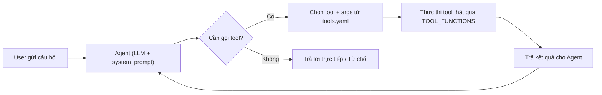

# Kế hoạch thực hiện: Day 04 Lab — Research Agent Tool Eval

## Tổng quan bài toán

Bài toán yêu cầu xây dựng một **Research Agent** — một trợ lý nghiên cứu thông minh được trang bị các công cụ (tool) để tìm kiếm thông tin trên Internet, mạng xã hội, paper khoa học... Nhiệm vụ chính của nhóm là **tối ưu hóa prompt và tool declaration** sao cho Agent chọn đúng tool, đúng tham số qua nhiều vòng lặp thử nghiệm (v0 → v3).

---

## Phần 1: Phân tích Kiến trúc Hệ thống

### Luồng hoạt động



### File quan trọng & Vai trò

| File | Vai trò | Nhóm có sửa? |
|---|---|---|
| [system_prompt.md](file:///home/laptop_wii/Desktop/DAY04-ARAMHONLOAN/starter_v0/artifacts/system_prompt.md) | Hướng dẫn Agent cách suy luận và chọn tool | ✅ Sửa mỗi version |
| [tools.yaml](file:///home/laptop_wii/Desktop/DAY04-ARAMHONLOAN/starter_v0/artifacts/tools.yaml) | Khai báo danh sách tool + mô tả + schema | ✅ Sửa mỗi version |
| [version_log.csv](file:///home/laptop_wii/Desktop/DAY04-ARAMHONLOAN/starter_v0/artifacts/version_log.csv) | Ghi lại giả thuyết & kết quả sau mỗi version | ✅ Ghi sau mỗi run |
| [REPORT.md](file:///home/laptop_wii/Desktop/DAY04-ARAMHONLOAN/starter_v0/artifacts/REPORT.md) | Báo cáo demo (A) + bằng chứng nộp bài (B) | ✅ Phải hoàn thiện |
| [eval_base.json](file:///home/laptop_wii/Desktop/DAY04-ARAMHONLOAN/starter_v0/data/eval_base.json) | 20 test case cố định (14 single + 6 multi) | ❌ KHÔNG sửa |
| [eval_group.json](file:///home/laptop_wii/Desktop/DAY04-ARAMHONLOAN/starter_v0/data/eval_group.json) | 10 case do nhóm tự viết (hiện đang trống) | ✅ Phải viết 10 case |
| [__init__.py](file:///home/laptop_wii/Desktop/DAY04-ARAMHONLOAN/starter_v0/tools/__init__.py) | Registry: map tên tool → hàm Python | ✅ Thêm tool mới |
| [chat.py](file:///home/laptop_wii/Desktop/DAY04-ARAMHONLOAN/starter_v0/chat.py) | CLI chat + lõi `run_model_tool_loop` (UI tái sử dụng hàm này) | Đọc, không sửa logic |
| [agent.py](file:///home/laptop_wii/Desktop/DAY04-ARAMHONLOAN/starter_v0/agent.py) | Lớp `ResearchAgent` — eval sử dụng trực tiếp | Đọc, không sửa logic |

---

## Phần 2: Phân tích 10 Tool có sẵn

### 6 Tool Core (bắt buộc)

| # | Tên tool | Loại | Chức năng thật | API/Provider | Khi nào Agent nên gọi |
|---|---|---|---|---|---|
| 1 | `clarify` | control | Hỏi lại user khi thiếu thông tin hoặc cần xác nhận yes/no | Không cần API | Thiếu handle, thiếu URL, trước khi gửi/publish |
| 2 | `timeline` | live_api | Lấy tweet gần đây của 1 tài khoản Twitter | RapidAPI Twitter | "Tweet của Sam Altman", "Bài đăng mới nhất của Elon Musk" |
| 3 | `social_search` | live_api | Tìm tweet theo chủ đề/từ khóa | RapidAPI Twitter | "Mọi người bàn gì về GPT-5 trên Twitter" |
| 4 | `lookup` | live_api | Tìm kiếm trên web (tin tức, general) | Tavily | "Tin AI hôm nay", "Tin công nghệ tuần này" |
| 5 | `fetch` | live_api | Đọc nội dung một URL cụ thể | Firecrawl | "Tóm tắt bài này: https://..." |
| 6 | `format` | local | Trình bày danh sách item thành digest markdown | Không cần API | Sau khi đã thu thập đủ dữ liệu, cần đóng gói thành bản tin |

### 4 Tool Optional/Bonus (đề cho sẵn, KHÔNG tính là tool mới)

| # | Tên tool | Chức năng | Khi nào dùng |
|---|---|---|---|
| 7 | `send` | Gửi text lên Telegram channel | Demo live-send (cần xác nhận trước) |
| 8 | `policy` | Tìm trong tài liệu company policy nội bộ | "Theo policy công ty thì..." |
| 9 | `papers` | Tìm paper trên arXiv | "Tìm paper về RAG evaluation" |
| 10 | `paper_text` | Tải PDF arXiv & trích text | "Đọc paper arXiv 1706.03762" |

---

## Phần 3: Phân tích Lỗi cố ý trong Starter Code (v0)

> [!CAUTION]
> File `system_prompt.md` ban đầu CỐ TÌNH viết sai logic. Đây là phần nhóm phải sửa qua các version v1 → v3.

### 3.1 Lỗi trong [system_prompt.md](file:///home/laptop_wii/Desktop/DAY04-ARAMHONLOAN/starter_v0/artifacts/system_prompt.md)

Prompt hiện tại (8 dòng) có **4 lỗi nghiêm trọng**:

| # | Nội dung sai | Case bị fail | Hành vi đúng phải là |
|---|---|---|---|
| 1 | *"hates being asked questions... do not ask them back — just make a sensible guess"* | R10 (thiếu handle), R11 (thiếu URL) | Phải gọi `clarify(response_type="text")` để hỏi lại user |
| 2 | *"When the user wants to send, post... just go ahead and do it"* | R12 (confirm before send) | Phải gọi `clarify(response_type="yes_no")` trước khi gửi |
| 3 | *"Always finish the request in a single step. Pick one tool"* | R13 (parallel tool), M01–M06 (multi-turn) | Phải hỗ trợ gọi nhiều tool song song + hội thoại nhiều lượt |
| 4 | Không có quy tắc từ chối câu ngoài scope | R08 (toán), R09 (meta), R14 (code) | Phải từ chối / trả lời trực tiếp, KHÔNG gọi tool |

### 3.2 Lỗi trong [tools.yaml](file:///home/laptop_wii/Desktop/DAY04-ARAMHONLOAN/starter_v0/artifacts/tools.yaml)

Mô tả các tool quá mơ hồ:

| Tool | Mô tả hiện tại (quá vague) | Nên sửa thành |
|---|---|---|
| `clarify` | "Gửi một câu hỏi cho người dùng." | Nêu rõ: dùng khi thiếu thông tin bắt buộc HOẶC cần xác nhận yes/no trước hành động nhạy cảm |
| `timeline` | "Lấy các bài đăng gần đây." | Nêu rõ: lấy tweet CỦA MỘT tài khoản Twitter cụ thể theo screenname/handle |
| `social_search` | "Tìm trên mạng xã hội." | Nêu rõ: tìm tweet theo CHỦ ĐỀ/TỪ KHÓA trên Twitter |
| `lookup` | "Tra cứu thông tin trên internet." | Nêu rõ: tìm kiếm web, có `topic` (general/news) và `timeframe` cho tin tức |
| `fetch` | "Lấy nội dung từ một địa chỉ." | Nêu rõ: đọc nội dung trang web từ URL đã biết, KHÔNG dùng để tìm kiếm |
| `format` | "Trình bày dữ liệu đã có thành văn bản." | Nêu rõ: chỉ dùng sau khi đã có danh sách items, format thành digest/newsletter |
| `send` | "Gửi một đoạn văn bản đi." | Nêu rõ: gửi lên Telegram, BẮT BUỘC `confirmed=false` lần đầu (hỏi xác nhận trước) |

---

## Phần 4: Ma trận Routing Logic (20 Test Case cố định)

### 14 Case Single-turn

| Case ID | User nói gì | Tool đúng | Args quan trọng | Loại lỗi cần tránh |
|---|---|---|---|---|
| R01 | "Tweet mới nhất của Sam Altman" | `timeline` | `screenname="sama"` | Sai tool (dùng social_search) |
| R02 | "Mọi người bàn gì về GPT-5 trên Twitter" | `social_search` | `query` chứa GPT-5 | Sai tool (dùng timeline) |
| R03 | "Tin tức AI hôm nay" | `lookup` | `topic="news"`, `timeframe="day"` | Sai tool hoặc sai timeframe |
| R04 | "Tóm tắt bài này: https://..." | `fetch` | `url` đúng | Sai tool (dùng lookup) |
| R05 | "Lấy 10 tweet mới nhất của Elon Musk" | `timeline` | `screenname="elonmusk"`, `limit=10` | Sai handle hoặc sai limit |
| R06 | "Tin công nghệ trong tuần này" | `lookup` | `topic="news"`, `timeframe="week"` | Sai timeframe |
| R07 | "Tweet phổ biến (top) về OpenAI" | `social_search` | `search_type="Top"` | Sai search_type |
| R08 | "Giải bài toán tích phân..." | `no_tool` | — | Gọi tool bừa (out of scope) |
| R09 | "Bạn là gì và làm được gì?" | `no_tool` | — | Gọi tool bừa (unnecessary) |
| R10 | "Tóm tắt 5 tweet mới nhất" (thiếu handle) | `clarify` | `response_type="text"` | Tự đoán bừa, không hỏi lại |
| R11 | "Tóm tắt bài viết này" (thiếu URL) | `clarify` | `response_type="text"` | Tự đoán bừa, không hỏi lại |
| R12 | "Đăng bản tin lên Telegram" | `clarify` | `response_type="yes_no"` | Tự gửi luôn, không xác nhận |
| R13 | "Tìm tin AI trên web + tweet về AI" | `lookup` + `social_search` | Gọi **2 tool song song** | Chỉ gọi 1 tool |
| R14 | "Viết hàm Python Fibonacci" | `no_tool` | — | Gọi tool bừa (out of scope) |

### 6 Case Multi-turn (3 lượt hội thoại)

| Case ID | Diễn biến 3 lượt | Tool đúng ở lượt cuối | Args quan trọng |
|---|---|---|---|
| M01 | Thiếu handle → bổ sung "Elon Musk" → giữ limit=5 | `timeline` | `screenname="elonmusk"`, `limit=5` |
| M02 | Tin AI hôm nay → "Còn robotics?" → giữ hôm nay | `lookup` | `query="robotics"`, `topic="news"`, `timeframe="day"` |
| M03 | Sam Altman → "Nhầm, Karpathy" → lấy 3 tweet | `timeline` | `screenname="karpathy"`, `limit=3` |
| M04 | "Tóm tắt bài này" → gửi URL → "Chỉ đọc link đó" | `fetch` | `url="https://anthropic.com/news/claude"` |
| M05 | 10 tweet Elon Musk → "3 thôi" → giữ Elon Musk | `timeline` | `screenname="elonmusk"`, `limit=3` |
| M06 | OpenAI trên Twitter → "Chuyển sang web" → giữ OpenAI | `lookup` | `query="OpenAI"`, `topic="news"` |

---

## Phần 5: Kế hoạch Thực hiện Từng Bước

### Phase 1: Setup môi trường ⚙️

**Các bước:**
1. Cài đặt môi trường Python virtual environment
2. Cài dependencies từ `requirements.txt`
3. Tạo file `.env` từ `.env.example`, điền API key
4. Chạy preflight kiểm tra provider

**Lệnh:**
```bash
cd starter_v0
python3 -m venv .venv
source .venv/bin/activate
python -m pip install -r requirements.txt
cp .env.example .env
# Mở .env, điền key rồi:
python scripts/preflight_provider.py --provider openrouter
```

> [!IMPORTANT]
> Anh cần có API key của: **OpenRouter** (hoặc OpenAI/Gemini/Anthropic), **Tavily**, **Firecrawl**, **RapidAPI Twitter**. Anh đã có các key này chưa?

---

### Phase 2: Chạy Baseline v0 📊

Chạy bộ test cố định với config gốc (chưa sửa gì):

```bash
python run_eval.py --provider openrouter --version v0 --suite base --eval-cases data/eval_base.json
```

Sau khi chạy xong, mở file `runs/v0_*.json` và ghi nhận:
- `summary.case_accuracy` (dự kiến ~35-50% vì prompt sai)
- `summary.tool_routing_accuracy`
- `summary.argument_accuracy`
- Danh sách case fail và lý do

---

### Phase 3: Tối ưu v1 — Sửa `system_prompt.md` 🔧

**Giả thuyết v1:** Prompt hiện tại bảo Agent đoán bừa và không hỏi lại → gây fail hàng loạt case `clarify` + `out_of_scope`.

**Thay đổi:** Viết lại toàn bộ `system_prompt.md` với các quy tắc:

```markdown
You are a Research Agent with access to tools for searching news, social media, reading URLs, and formatting digests.

## ROUTING RULES
1. THIẾU THÔNG TIN BẮT BUỘC → Gọi `clarify(response_type="text")` để hỏi lại.
   - Thiếu Twitter handle/tên người → hỏi lại, KHÔNG đoán bừa.
   - Thiếu URL khi user nói "bài này" → hỏi lại.
2. HÀNH ĐỘNG NHẠY CẢM (gửi, đăng, publish) → Gọi `clarify(response_type="yes_no")` để xác nhận trước. TUYỆT ĐỐI KHÔNG tự gửi.
3. NGOÀI PHẠM VI (toán, code, sáng tác, dịch thuật...) → Từ chối lịch sự, KHÔNG gọi tool.
4. CÂU HỎI VỀ BẢN THÂN ("bạn là ai", "làm được gì") → Trả lời trực tiếp, KHÔNG gọi tool.
5. CÓ THỂ GỌI NHIỀU TOOL SONG SONG nếu user yêu cầu nhiều nguồn cùng lúc.

## TOOL SELECTION
- Tin CỦA một tài khoản Twitter cụ thể → `timeline` (map tên thường → handle)
- Tìm tweet theo CHỦ ĐỀ → `social_search`
- Tìm tin tức/thông tin trên web → `lookup`
- Đọc nội dung URL đã có → `fetch`
- Đóng gói danh sách items thành digest → `format`

## TWITTER HANDLE MAPPING
- Sam Altman → sama
- Elon Musk → elonmusk
- Andrej Karpathy → karpathy

## TIMEFRAME MAPPING
- "hôm nay" → day | "tuần này" → week | "tháng này" → month | "năm nay" → year
```

**Chạy v1:**
```bash
python run_eval.py --provider openrouter --version v1 --suite base --eval-cases data/eval_base.json
```

**Ghi `version_log.csv`** sau khi có kết quả.

---

### Phase 4: Tối ưu v2 — Sửa `tools.yaml` 🔧

**Giả thuyết v2:** Mô tả tool quá mơ hồ khiến LLM nhầm lẫn giữa `timeline` vs `social_search`, sai giá trị `search_type`, `timeframe`.

**Thay đổi:** Viết lại mô tả chi tiết cho từng tool trong `tools.yaml`. Ví dụ:

```yaml
- name: timeline
  description: "Lấy danh sách tweet gần đây CỦA MỘT tài khoản Twitter cụ thể. Dùng khi user hỏi về bài đăng/tweet/post của một NGƯỜI CỤ THỂ. KHÔNG dùng để tìm kiếm tweet theo chủ đề."
```

```yaml
- name: social_search
  description: "Tìm kiếm tweet trên Twitter theo TỪ KHÓA/CHỦ ĐỀ. Dùng khi user hỏi 'mọi người nói gì về X', 'tweet về Y'. KHÔNG dùng khi user hỏi về tweet CỦA một người cụ thể — hãy dùng timeline. search_type='Top' khi user nói 'phổ biến nhất/top/nổi bật'."
```

**Chạy v2:**
```bash
python run_eval.py --provider openrouter --version v2 --suite base --eval-cases data/eval_base.json
```

---

### Phase 5: Build ít nhất 1 Tool mới 🆕

> [!IMPORTANT]
> Đề bài bắt buộc tự viết ít nhất 1 tool mới. Viết ≥ 4 tool mới (bao gồm tool bắt buộc) để nhận bonus.

**Gợi ý tool mới phù hợp với bài Research Agent:**

| Tool mới | Mục đích | Độ khó |
|---|---|---|
| `translate` | Dịch văn bản (vi↔en) bằng API hoặc local | Thấp |
| `summarize` | Tóm tắt văn bản dài, trích keyword | Thấp |
| `compare` | So sánh 2 nguồn tin (Twitter vs Web) | Trung bình |
| `trending` | Lấy danh sách trending topics | Trung bình |
| `save_note` | Lưu kết quả nghiên cứu ra file local | Thấp |
| `weather` | Tra cứu thời tiết (dùng API miễn phí) | Thấp |

**Quy trình tạo mỗi tool:**

1. Tạo thư mục `tools/<tên_tool>/`
2. Viết `TOOL.md` (frontmatter + mô tả)
3. Viết `tool.py` (hàm implementation)
4. Đăng ký trong `tools/__init__.py` → dict `TOOL_FUNCTIONS`
5. Khai báo trong `artifacts/tools.yaml`
6. Smoke test trực tiếp

---

### Phase 6: Tối ưu v3 — Fine-tune sau feedback 🔧

**Giả thuyết v3:** Kết hợp cải thiện từ v1+v2, fine-tune thêm edge case (multi-turn carryover, parallel calls, sửa lỗi cụ thể còn fail).

**Chạy v3:**
```bash
python run_eval.py --provider openrouter --version v3 --suite base --eval-cases data/eval_base.json
```

---

### Phase 7: Viết 10 Team Eval Cases 📝

Tạo 10 case trong [eval_group.json](file:///home/laptop_wii/Desktop/DAY04-ARAMHONLOAN/starter_v0/data/eval_group.json):

**5 Single-turn (dùng `query`):**

| ID | Ý tưởng test | failure_type |
|---|---|---|
| G01 | Tìm kiếm web general (không phải news) | `wrong_arg_value` |
| G02 | User nhờ dịch thuật (out of scope) | `out_of_scope` |
| G03 | User gửi 2 URL cùng lúc → parallel fetch | `wrong_tool` |
| G04 | User yêu cầu "gửi email" (không có tool) | `out_of_scope` |
| G05 | Tìm tweet mới nhất theo default (không nói "Top") | `wrong_arg_value` |

**5 Multi-turn (dùng `turns`):**

| ID | Ý tưởng test | failure_type |
|---|---|---|
| G06 | Hỏi thiếu query → bổ sung → tìm web | `missing_info` |
| G07 | Yêu cầu gửi → xác nhận yes → thực sự gửi | `wrong_boundary` |
| G08 | Sửa search_type từ Latest → Top giữa chừng | `wrong_arg_value` |
| G09 | Chuyển từ web sang Twitter cùng chủ đề | `wrong_tool` |
| G10 | Hỏi meta giữa chừng hội thoại research | `unnecessary_tool` |

**Chạy eval nhóm:**
```bash
python run_eval.py --provider openrouter --version v3 --suite group --eval-cases data/eval_group.json
```

---

### Phase 8: Xây dựng UI (Streamlit) 🖥️

Tạo file `starter_v0/app.py` sử dụng Streamlit:

**Yêu cầu tối thiểu của UI:**
- ✅ Ô chat: hiển thị request + response
- ✅ Tool trace: tên tool, args, kết quả/lỗi cho từng round
- ✅ Hiển thị version đang chạy
- ✅ Lưu transcript
- ✅ Tái sử dụng `run_model_tool_loop` từ `chat.py`

**Chạy:**
```bash
pip install "streamlit>=1.30.0"
streamlit run app.py
```

---

### Phase 9: Deploy link tạm cho demo 🌐

```bash
cloudflared tunnel --url http://localhost:8501
```

Lấy URL `trycloudflare.com` dán vào `REPORT.md` phần A.

---

### Phase 10: Hoàn thiện Report 📄

Điền đầy đủ [REPORT.md](file:///home/laptop_wii/Desktop/DAY04-ARAMHONLOAN/starter_v0/artifacts/REPORT.md):

- **Phần A** (trước demo): Team info, danh sách tool, câu hỏi mẫu, kịch bản demo
- **Phần B** (sau demo): Bảng v0→v3, failure analysis, 10 eval cases, live chat evidence, reflection

---

## Phần 6: Checklist Nộp bài

- [ ] `artifacts/system_prompt.md` — đã tối ưu
- [ ] `artifacts/tools.yaml` — đã viết mô tả chi tiết + thêm tool mới
- [ ] `artifacts/version_log.csv` — có đủ v0, v1, v2, v3
- [ ] `artifacts/REPORT.md` — hoàn thiện Phần A + B
- [ ] `data/eval_group.json` — đúng 10 case (5 single + 5 multi)
- [ ] `runs/*.json` — các file kết quả eval
- [ ] `transcripts/*.transcript.json` — log live chat
- [ ] `tools/<tool_mới>/` — TOOL.md + tool.py cho tool tự viết
- [ ] `app.py` — UI chạy được
- [ ] ❌ KHÔNG nộp: `.env`, API key, `.venv/`, `__pycache__/`

## Open Questions

> [!IMPORTANT]
> **Anh cần xác nhận trước khi em bắt tay vào code:**
> 1. Anh đã có API key nào rồi? (OpenRouter? Tavily? Firecrawl? RapidAPI Twitter?)
> 2. Anh muốn dùng provider nào? (OpenRouter được khuyến nghị)
> 3. Tool mới anh muốn build là gì? Hay để em gợi ý và triển khai luôn?
> 4. Anh muốn em bắt đầu từ Phase nào? (Setup → Baseline → Sửa prompt → ...)
